## Overview

As part of the [CardioNIR project](https://doi.org/10.54499/PTDC/EMD-EMD/3822/2021) (PTDC/EMD-EMD/3822/2021), we performed comprehensive proteomic characterisation of cardiovascular proteins during cardiac surgery with cardiopulmonary bypass (CPB) in a preclinical swine model (WP2). Using the **Olink Proximity Extension Assay (PEA)** platform with the **CVD III panel** (92 cardiovascular proteins), we profiled temporal protein dynamics across four surgical phases: Basal, Extracorporeal Circulation (ECCT), Ischemia, and Reperfusion.

::: {.callout-note}
## Study Design
Twelve Landrace cross pigs underwent cardiac surgery under CPB. Seven surgeries were completed with full protocol adherence, yielding **84 samples** across all four experimental phases. After QC filtering, **49 proteins** and **4,116 observations** were retained for analysis.
:::

## Global Protein Expression

### NPX Distribution

The global distribution of Normalized Protein Expression (NPX) values was right-skewed, with a mean of −0.813. Comparison across experimental phases revealed relatively stable medians with differences in dispersion and outlier distribution, suggesting that the surgical intervention induces heterogeneous protein-level responses rather than a uniform shift.

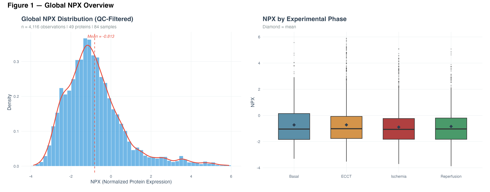{#fig-npx-distribution}

### Top Variable Proteins

Hierarchical clustering of the 20 most variable proteins (row-scaled Z-scores) identified two major expression patterns:

- **Downregulated during ECCT/Ischemia:** COL1A1, PRTN3, PAI, RARRES2, RETN, CASP-3, CD93, TFPI
- **Upregulated during Ischemia/Reperfusion:** MB, MCP-1, CD163, AXL, SCGB3A2, OPN

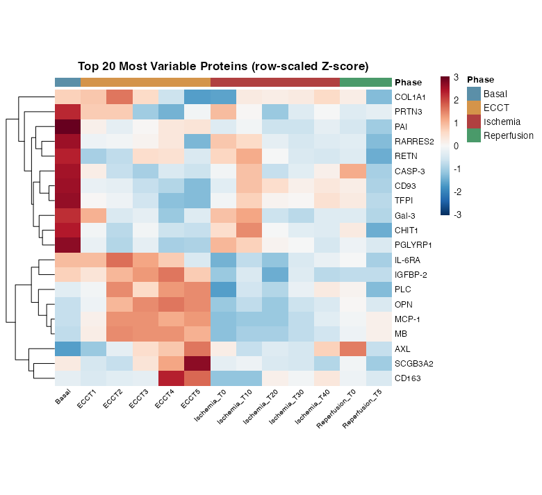{#fig-heatmap-top20}

## Temporal Protein Dynamics

### Key Protein Trajectories

Temporal profiles of eight biologically relevant proteins across experimental phases revealed distinct response patterns:

- **Myoglobin (MB)** showed marked increase during Ischemia/Reperfusion, consistent with myocardial tissue injury
- **MCP-1** demonstrated progressive upregulation reflecting inflammatory monocyte recruitment
- **PAI** and **TFPI** showed significant downregulation during bypass, indicating consumption of coagulation regulators
- **RETN** and **RARRES2** decreased during ECCT/Ischemia, suggesting metabolic and adipokine alterations
- **CASP-3** declined progressively, potentially reflecting apoptotic pathway modulation
- **CD93** showed sustained downregulation throughout surgical phases

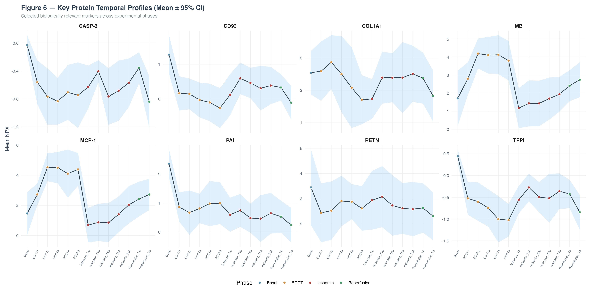{#fig-temporal-profiles}

## Differential Expression Analysis

### Volcano Plot — Mixed Model Results

Linear mixed model analysis (NPX ~ Condition + (1|Animal)) with FDR correction identified **14 significantly differentially expressed proteins**:

| Direction | Proteins | Estimated Effect |
|-----------|----------|-----------------|
| **Upregulated** | MCP-1, MB, OPN, CD163, PLC | +0.7 to +3.0 |
| **Downregulated** | PAI, TFPI, CD93, RARRES2, CASP-3, IL-6RA, Gal-3 | −0.5 to −2.5 |

: **Table 1.** Summary of significantly differentially expressed proteins (FDR < 0.05) from the linear mixed model. {#tbl-de-proteins}

MCP-1 showed the largest upregulation (~+3.0 NPX) and MB the highest statistical significance. Among downregulated proteins, PAI exhibited the largest negative effect with strong significance.

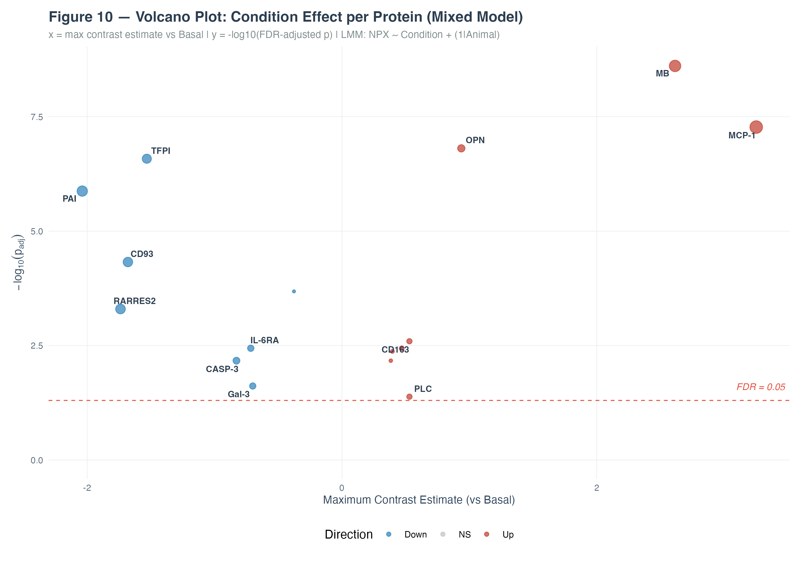{#fig-volcano-plot}

### MCP-1 Ischemia Dose-Response

Dose-response analysis revealed a significant positive linear trend for **MCP-1** with increasing ischemia duration (0–40 minutes), supporting its role as a time-dependent inflammatory biomarker during cardiac ischemia.

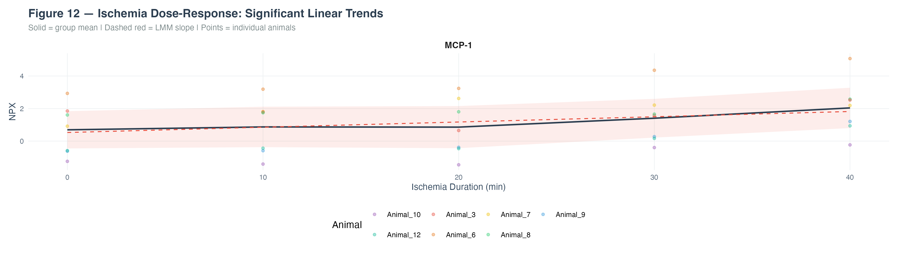{#fig-mcp1-dose-response}

## Multivariate Analysis

### PCA — Sample-Level Proteome Trajectory

Principal Component Analysis revealed clear phase-dependent clustering of the proteome. PC1 (28.4%) and PC2 (11.6%) separated Basal from ECCT and Ischemia/Reperfusion phases.

**Key observations:**

- Basal samples formed a distinct cluster, well-separated from surgical phases
- ECCT and Ischemia samples showed partial overlap, suggesting a continuum of protein changes
- Reperfusion samples displayed the widest dispersion, reflecting heterogeneous recovery patterns
- Individual animal trajectories followed consistent Basal → ECCT → Ischemia → Reperfusion progression

**Top loadings:** CXCL16, IGFBP-1, TNF-R2 (positive PC1); CCL16, COL1A1, SPON1 (negative PC2).

{#fig-pca-trajectory}

### Within-Animal Delta-from-Basal Analysis

To account for inter-animal variability, we computed within-animal changes (ΔNPX) relative to each animal's own basal values. This paired analysis revealed:

- A transient increase during early ECCT followed by progressive decline through ischemia
- Partial recovery during reperfusion (not returning to basal levels)
- The eight most responsive proteins showed consistent patterns across animals, with MCP-1 and MB exhibiting the largest positive deltas and CD93, PRTN3, RARRES2 showing the most pronounced negative shifts

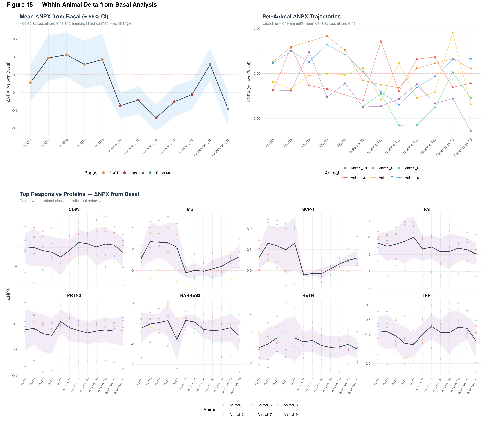{#fig-delta-basal}

## Network Analysis

### Protein Correlation Structure

Spearman correlation analysis with hierarchical clustering revealed five co-expression modules:

| Module | Key Proteins | Functional Theme |
|--------|-------------|------------------|
| **M1** (red) | GP6, Gal-4, CPA1, TNF-R2, CDH5, CXCL16 | Inflammatory/adhesion signalling |
| **M2** (orange) | PAI, RARRES2, CD163, t-PA, vWF, CCL16 | Coagulation and haemostasis |
| **M3** (green) | MB, MCP-1, OPN | Ischemic injury markers |
| **M4** (blue) | PRTN3, uPA, Gal-3, AZU1, CHIT1, RETN | Neutrophil-associated proteins |
| **M5** (purple) | SCGB3A2, PGLYRP1 | Innate immunity |

: **Table 2.** Protein co-expression modules identified by hierarchical clustering of Spearman correlations. {#tbl-modules}

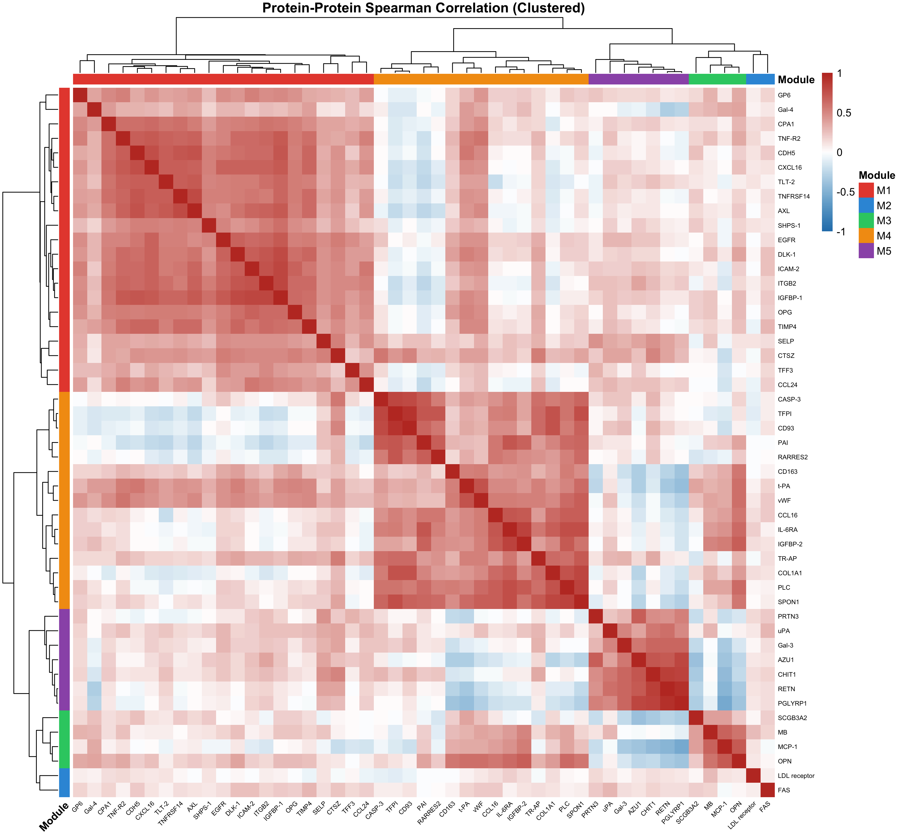{#fig-correlation-matrix}

### Co-Expression Network

Network analysis (|ρ| ≥ 0.55) produced a graph with **42 nodes** and **161 edges**. Louvain community detection (modularity Q = 0.553) identified three major communities:

- **C1** (red): Inflammatory/adhesion cluster — TNF-R2, CDH5, CXCL16, ICAM-2, AXL, IGFBP-1
- **C2** (blue): Coagulation cluster — vWF, SPON1, and related proteins
- **C3** (green): Peripheral cluster with loosely connected members

Hub proteins with the highest connectivity scores included SPON1, vWF (C2), and CXCL16, ICAM-2 (C1).

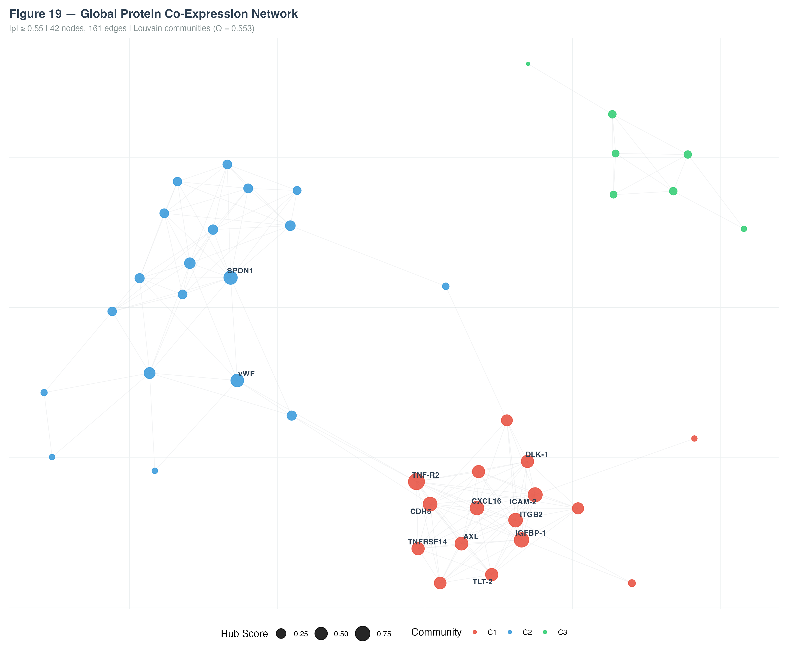{#fig-coexpression-network}

## Phase-Specific Co-Expression Networks

Beyond the global network, phase-specific network analysis reveals the dramatic rewiring of the cardiovascular proteome during surgery. Using the same |ρ| ≥ 0.55 threshold across all phases:

- **Basal** (410 edges): Dense, integrated network with extensive cross-module connectivity reflecting coordinated homeostatic regulation
- **ECCT** (118 edges): ~70% connectivity loss — bypass disrupts co-regulation and modules segregate spatially
- **Ischemia** (215 edges): Partial recovery with fragmented topology — two main clusters emerge (endothelial core + SPON1/ECM module)
- **Reperfusion** (228 edges): Rewired, not restored — dense M4 module with persistent separation suggests early repair signalling

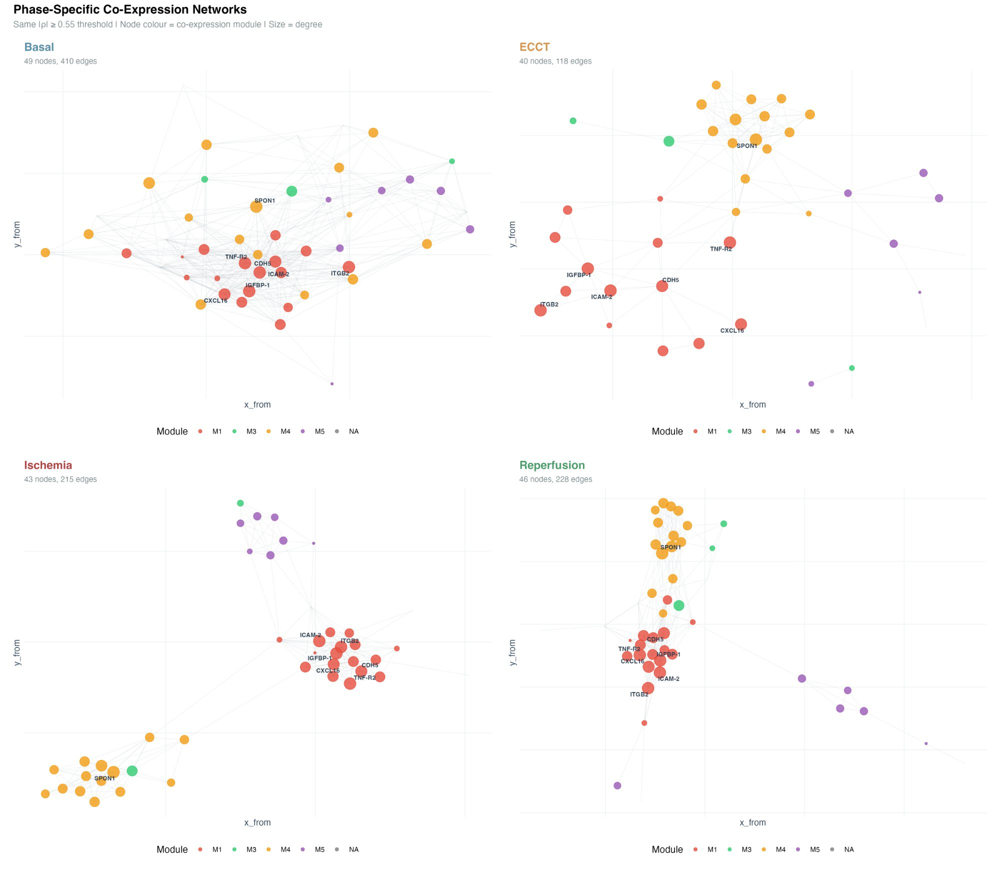{#fig-phase-networks}

Hub proteins — CDH5 (VE-Cadherin), ICAM-2, ITGB2, TNF-R2, CXCL16, and IGFBP-1 — maintained central roles in the inflammatory/adhesion module (M1) across phases, while SPON1 (Spondin-1) emerged as a key hub specifically during reperfusion, implicating ECM remodelling in early recovery.

## Protein Detection Profiles

### Detection Rates Across Phases

Hierarchical clustering of protein detection rates across timepoints revealed three distinct groups:

1. **Consistently detected** across all phases — core cardiovascular panel
2. **Phase-dependent detection** — proteins detectable only during specific surgical phases (predominantly ischemia/reperfusion), likely reflecting release from damaged tissue
3. **Low/variable detection** — proteins at or near the assay limit of detection

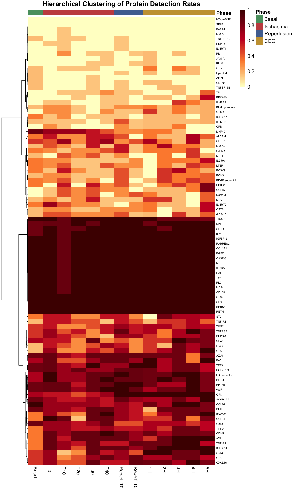{#fig-detection-rates}

### PCA of Detection Profiles

PCA of the detection rate matrix confirmed: PC1 alone explained **87.3%** of variance, with timepoints organized by experimental phase. Four distinct protein clusters emerged based on detection profiles.

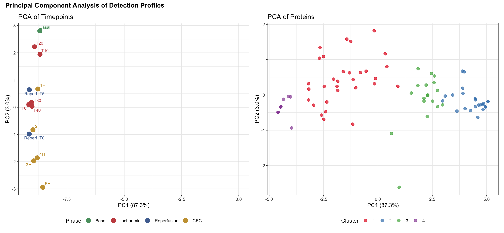{#fig-pca-detection}

## Key Findings

::: {.callout-tip}
## Summary
1. **MCP-1** and **myoglobin** emerged as the dominant ECCT-responsive markers — MCP-1 as a time-dependent inflammatory biomarker, myoglobin as an injury indicator
2. **14 proteins** were significantly differentially expressed across surgical conditions (FDR < 0.05)
3. The proteome follows a clear **Basal → ECCT → Ischemia → Reperfusion** trajectory in multivariate space
4. **Five co-expression modules** capture functionally coherent biological processes (inflammation, coagulation, ischemic injury, neutrophil response, innate immunity)
5. Within-animal analysis confirms that reperfusion creates a **reorganised rather than recovered** proteomic state
:::

## Methodological Note: Hemodilution

An important methodological finding: the hemodilution induced by the CPB machine (priming volume ~800 mL in pigs) systematically affected DBS signal-to-noise ratios. ECCT samples showed diluted protein concentrations compared to basal, which must be accounted for in downstream analyses. Future workflows will normalise molecular signals to total protein content or use internal calibration standards to correct for this effect.

## Related

- [CardioNIR — NIRS in PAD](cardionir-pad-nirs.html)
- [CardioNIR — Metabolomics Results](cardionir-metabolomics.html)
- [Project Reference: PTDC/EMD-EMD/3822/2021](https://doi.org/10.54499/PTDC/EMD-EMD/3822/2021)
